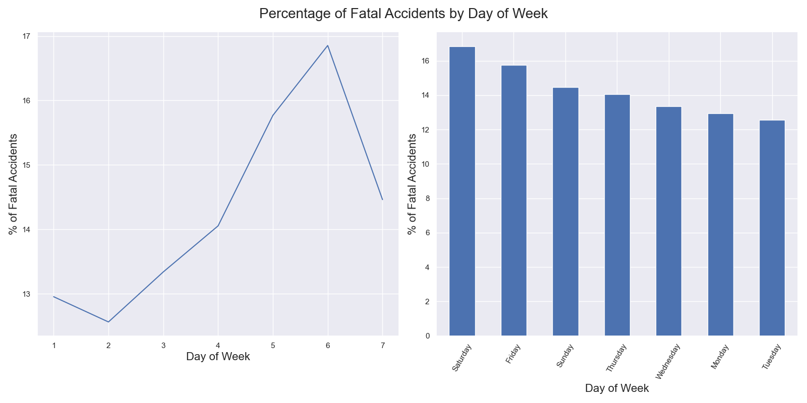
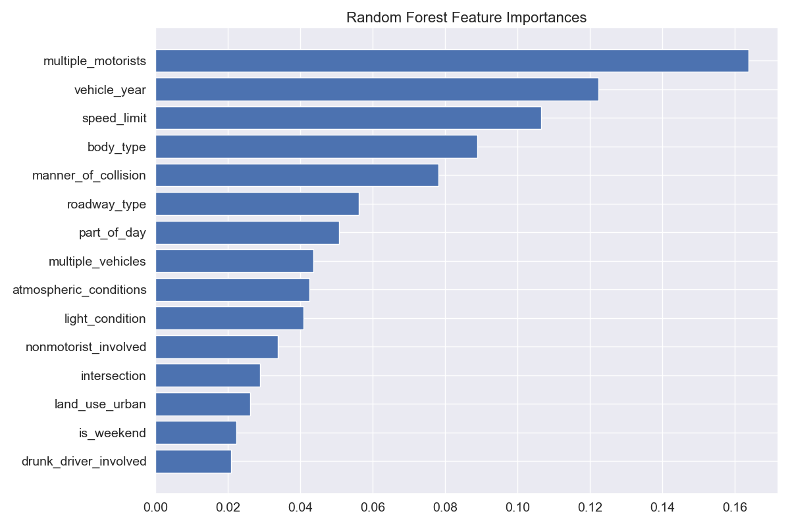
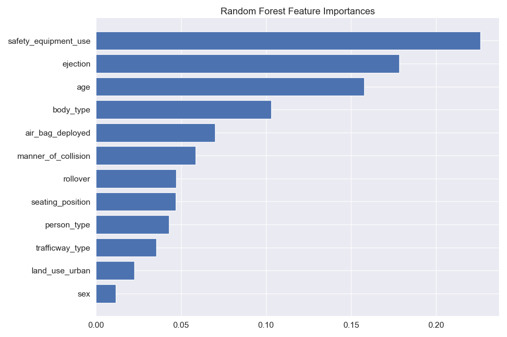
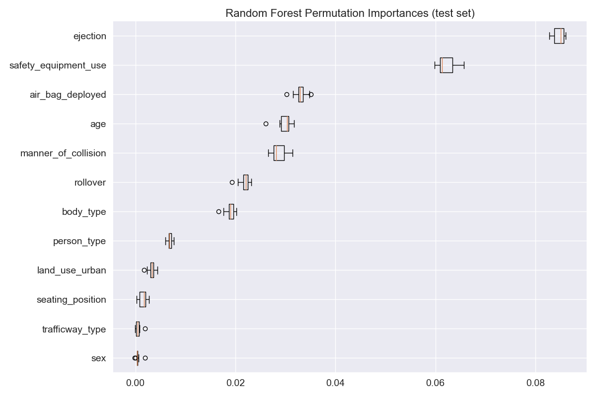
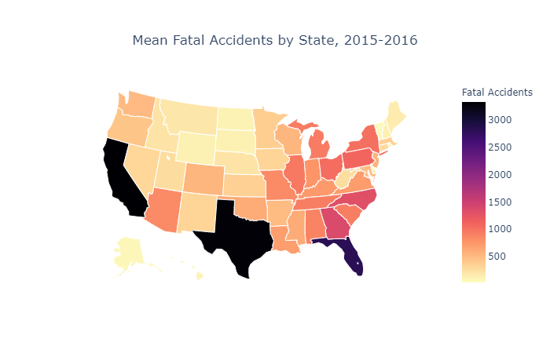
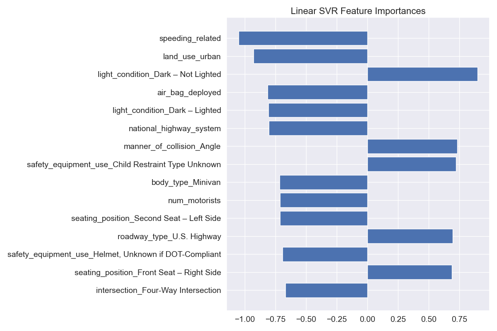

# ITCS 6100: Fatal Traffic Accidents Analysis

## Data
Data for this project were sourced from Kaggle's [US Traffic Fatality Records:
Fatal car crashes for 2015-2016](https://www.kaggle.com/usdot/nhtsa-traffic-fatalities) dataset, which contains data published by the NHTSA.
The data were queried using Google's BigQuery API. For this analysis, three different datasets were generated that look at the fatal accident data at three different levels:
- Vehicle-level data
- Individual person-level data
- Aggregated state-level data

Population data for US states in 2015-2016 was sourced from the US Census Bureau's [State Population Totals: 2010-2019](https://www.census.gov/data/datasets/time-series/demo/popest/2010s-state-total.html).

## Data Exploration

Initial data exploration showed that more fatal accidents occurred in the evening hours and on weekends.
A local peak of fatal accidents is also visible during rush hour in the mornings.
More fatal accidents occur from May-October, which may be because there are more cars on the road during the summer months.

## Vehicle-level Analysis
A classification analysis was performed to determine which features were most predictive of a multiple-fatality accident.
To account for the severe class imbalance between single and multiple fatalities, the minority class data were oversampled to generate a class-balanced dataset for classification.

Random Forest, Logistic Regression, K-Nearest Neighbors, and SVC models were fit and evaluated on the data.
The Random Forest model achieved the best performance. For this model, feature importance was calculated using Mean Decrease Impurity (MDI).
In addition, permutation importance was calculated for each feature as well.

Feature importance using MDI can be biased towards numerical and multi-category features.
Using permutation importance can be useful when trying to correct for this bias.

Unsurprisingly, an accident involving multiple motorists (motorists are defined as anyone in a motor vehicle, not just drivers)
is the single best predictor of a multiple-fatality accident.

The most important factor other than multiple motorists seems to be speed limit, with multiple-fatality accidents tending to occur in zones with higher speed limits.
This is reinforced by the high importance of roadway_type and national_highway_system, which is a binary feature indicating whether an accident occurred on a US highway/interstate.

Within the manner of collision category, analysis showed that Front-to-Front collisions were predictive of multiple fatalities, while
non-collisions with another vehicle were unlikely to result in multiple fatalities.

Surprisingly, accidents in urban areas were less likely to result in multiple fatalities.

## Person-level Analysis
A classification analysis was performed to determine which features were most predictive of an individual fatality in a fatal accident.
Individuals involved in fatal accidents were classified as fatal injury or non-fatal.
Random Forest and Logistic Regression models were trained and evaluated on the data. Again, the Random Forest model achieved the best performance.
Feature importances using MDI and permutation importances for each feature were calculated.

This analysis revealed that safety equipment usage and the occurrence of a full or partial ejection during an accident were most predictive of a fatality.

Using a shoulder and lap belt was predictive of a non-fatal injury. As was not being ejected from the vehicle, which is likely correlated with using a lap and shoulder seat belt.
Additionally, the deployment of an airbag was indicative of a non-fatal injury.

On the other hand, not using safety equipment was predictive of a fatal injury. Ejection_Not Applicable, which describes non-motorists (pedestrians/cyclists) was predictve of a fatal injury as well.
Within the Person Type category, the driver of a motor vehicle was the most likely to be killed in a fatal accident, though this is likely skewed by accidents where a driver was the only individual involved.

## State-level Analysis
Data about fatal accidents and fatalities were aggregated state-by-state. The mean value by state of features from the vehicle and person-level analyses were generated to compare accident profiles across states.
The number of fatal accidents per 100k population was calculated from the US Census data.

Interestingly, Mississippi and Wyoming were shown to have the highest number of fatal accidents per capita.

A regression analysis was performed determine which features were most explanatory of the differences between fatal accident rates across US States.
Linear Regression, Ridge, ElasticNet, and SVR models were trained and evaluated on the aggregated state data, with the SVR and Linear Regression models achieving the best performance.
Feature importances were estimated using the model weights, and permutation importances were calculated for each feature.

---

A surprising finding was that the proportion of speeding related accidents was negatively correlated with fatal accident rates.
Accidents in urban areas were also negatively correlated with fatal accident rates,
which supports the finding from the vehicle-level analysis that urban accidents were less likely to result in multiple fatalities.

Deployment of an airbag was negatively correlated as well, supporting the findings from the person-level analysis that airbag deployment reduced the likelihood of a fatal injury.
Conversely, not using safety equipment was positively correlated with fatal accident rates.

Both models picked out dark light conditions with no lighting as the strongest positively correlated feature with fatal accident rates.
The difference between dark un-lighted and dark lighted roadways was especially striking.

A correlation analysis revealed that Standard Pickups were strongly correlated with higher rates of fatal accidents, whereas minivans were negatively associated with fatal accident rates.

## Conclusion

Analysis of fatal traffic accidents in the US in 2015-2016 revealed that dark un-lighted streets were strongly correlated with increased rates of fatal accidents.
Both Mississippi and Wyoming rank highly among the states in terms of the proportion of their fatal accidents that occur in dark un-lighted conditions.
This is possibly due to the rural nature of the states, as urban areas were identified as safer and less likely to result in multiple fatality accidents.
It is also possible that urban areas have more responsive emergency services and access to hospital care than do rural areas.

Roads with higher speed limits, such as interstates and US highways, were more likely to result in fatal accidents, which is unsurprising given the severity of accidents at higher speeds.
Surprisingly though, speeding was not a strong causal factor in these accidents. Use of safety equipment,
especially combination lap and shoulder seatbelts, were indicative of non-fatal injuries in fatal accidents.
Ejection from the vehicle, correlated with not using safety equipment, was strongly related to an individual sustaining fatal injury in an accident.
Again, Mississippi and Wyoming ranked low among the states in terms of safety-equipment use in fatal accidents.

Overall, be extra careful when traveling at high speeds and especially when in dark un-lighted conditions - more likely in rural areas. 
States should seek to increase lighting coverage, especially on their high speed limit roadways such as Interstates and US highways.
Pickups were the body type most strongly correlated with higher fatal accident rates, while minivans were associated with lower rates of fatal accidents.

Most of all: Wear your seatbelt!
